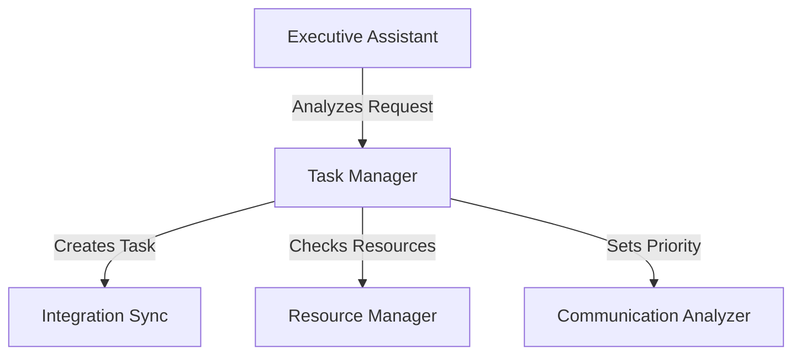
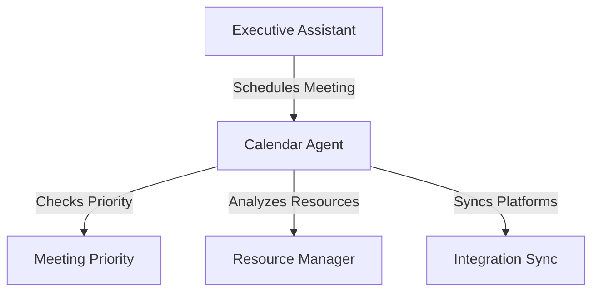

# AI Agent System Architecture

Detailed breakdown of agent roles, responsibilities, and interactions

## 1. Core Agent Framework

### 1.1 Executive Assistant Agent (Orchestrator)

**Primary Function**: High-level coordination and task delegation

```json
{
  "agent_type": "ExecutiveAssistant",
  "responsibilities": [
    "User input interpretation",
    "Agent task delegation",
    "Priority management",
    "Cross-agent coordination"
  ],
  "tools": [
    "natural_language_parser",
    "priority_calculator",
    "agent_selector",
    "workflow_orchestrator"
  ]
}
```

**Key Functions**:
- Analyzes user requests and determines required agents
- Manages multi-agent workflows
- Handles escalations and conflicts
- Ensures task completion and follow-up

### 1.2 Task Management Agent

**Primary Function**: Comprehensive task handling and organization

```json
{
  "agent_type": "TaskManager",
  "responsibilities": [
    "Task creation and updates",
    "Priority assessment",
    "Deadline management",
    "Resource allocation"
  ],
  "tools": [
    "task_creator",
    "deadline_calculator",
    "resource_allocator",
    "dependency_analyzer",
    "workload_balancer"
  ]
}
```

**Key Functions**:
- Creates and structures tasks from various inputs
- Manages task dependencies and relationships
- Handles task prioritization and scheduling
- Monitors task progress and updates

### 1.3 Calendar Intelligence Agent

**Primary Function**: Advanced calendar management and scheduling

```json
{
  "agent_type": "CalendarAgent",
  "responsibilities": [
    "Meeting scheduling",
    "Conflict resolution",
    "Availability management",
    "Schedule optimization"
  ],
  "tools": [
    "schedule_optimizer",
    "conflict_resolver",
    "availability_checker",
    "meeting_scheduler",
    "timezone_manager"
  ]
}
```

**Key Functions**:
- Handles complex scheduling scenarios
- Resolves calendar conflicts
- Manages recurring meetings
- Optimizes meeting times across timezones

### 1.4 Meeting Priority Agent

**Primary Function**: Meeting importance assessment and optimization

```json
{
  "agent_type": "MeetingPriority",
  "responsibilities": [
    "Meeting importance scoring",
    "Participant analysis",
    "Schedule conflict resolution",
    "Meeting effectiveness tracking"
  ],
  "tools": [
    "importance_calculator",
    "participant_analyzer",
    "sentiment_analyzer",
    "effectiveness_tracker"
  ]
}
```

**Key Functions**:
- Calculates meeting importance scores (0-10)
- Analyzes participant roles and seniority
- Evaluates meeting content and context
- Tracks meeting effectiveness

### 1.5 Communication Analysis Agent

**Primary Function**: Email and message analysis

```json
{
  "agent_type": "CommunicationAnalyzer",
  "responsibilities": [
    "Email sentiment analysis",
    "Priority classification",
    "Action item extraction",
    "Communication pattern analysis"
  ],
  "tools": [
    "sentiment_analyzer",
    "priority_classifier",
    "action_extractor",
    "pattern_analyzer"
  ]
}
```

**Key Functions**:
- Analyzes email sentiment and urgency
- Extracts action items and deadlines
- Identifies communication patterns
- Classifies message priority

### 1.6 Integration Sync Agent

**Primary Function**: Cross-platform data synchronization

```json
{
  "agent_type": "IntegrationSync",
  "responsibilities": [
    "Cross-platform synchronization",
    "Data mapping",
    "Conflict resolution",
    "Update propagation"
  ],
  "tools": [
    "sync_manager",
    "conflict_resolver",
    "data_mapper",
    "api_connector"
  ],
  "supported_platforms": [
    "Notion",
    "Jira",
    "GitHub",
    "Trello",
    "Slack",
    "MS Teams"
  ]
}
```

**Key Functions**:
- Manages bi-directional data sync
- Resolves cross-platform conflicts
- Handles data mapping and transformation
- Maintains sync status and history

### 1.7 NLP Summarizer Agent

**Primary Function**: Content summarization and analysis

```json
{
  "agent_type": "Summarizer",
  "responsibilities": [
    "Meeting transcription",
    "Content summarization",
    "Action item extraction",
    "Key point identification"
  ],
  "tools": [
    "transcription_processor",
    "summary_generator",
    "action_extractor",
    "keyword_analyzer"
  ]
}
```

**Key Functions**:
- Processes meeting recordings
- Generates comprehensive summaries
- Extracts action items and decisions
- Creates meeting minutes

### 1.8 Resource Management Agent

**Primary Function**: Team and resource optimization

```json
{
  "agent_type": "ResourceManager",
  "responsibilities": [
    "Team workload analysis",
    "Resource allocation",
    "Capacity planning",
    "Skill matching"
  ],
  "tools": [
    "workload_analyzer",
    "resource_allocator",
    "capacity_planner",
    "skill_matcher"
  ]
}
```

**Key Functions**:
- Analyzes team workload
- Optimizes resource allocation
- Manages team capacity
- Matches tasks to skills

## 2. Agent Interaction Workflows

### 2.1 Task Creation Workflow



### 2.2 Meeting Scheduling Workflow



## 3. Agent Communication Protocol

```json
{
  "message_format": {
    "sender_agent": "string",
    "receiver_agent": "string",
    "message_type": "string",
    "priority": "number",
    "payload": {
      "action": "string",
      "parameters": "object",
      "context": "object"
    },
    "timestamp": "datetime"
  }
}
```

